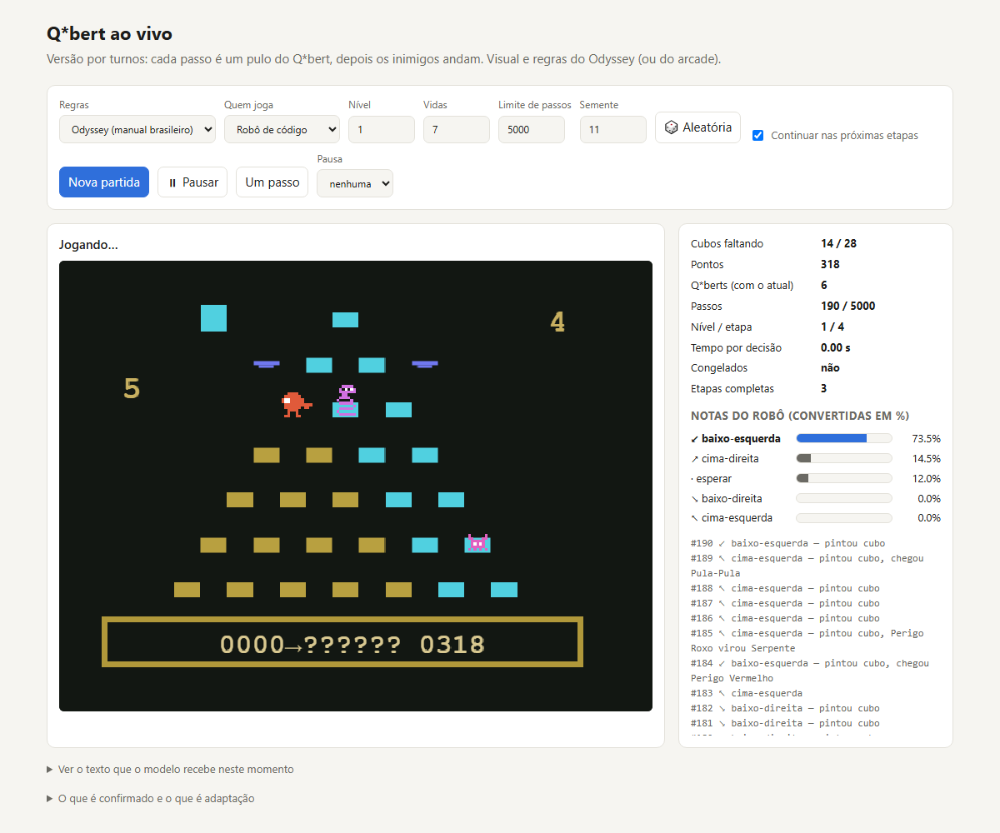
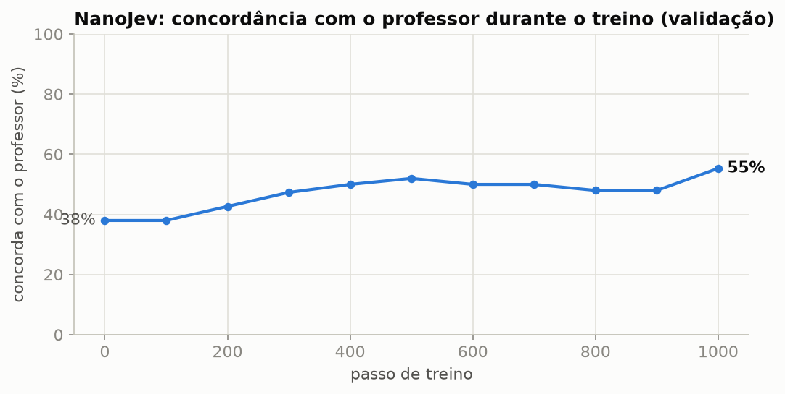
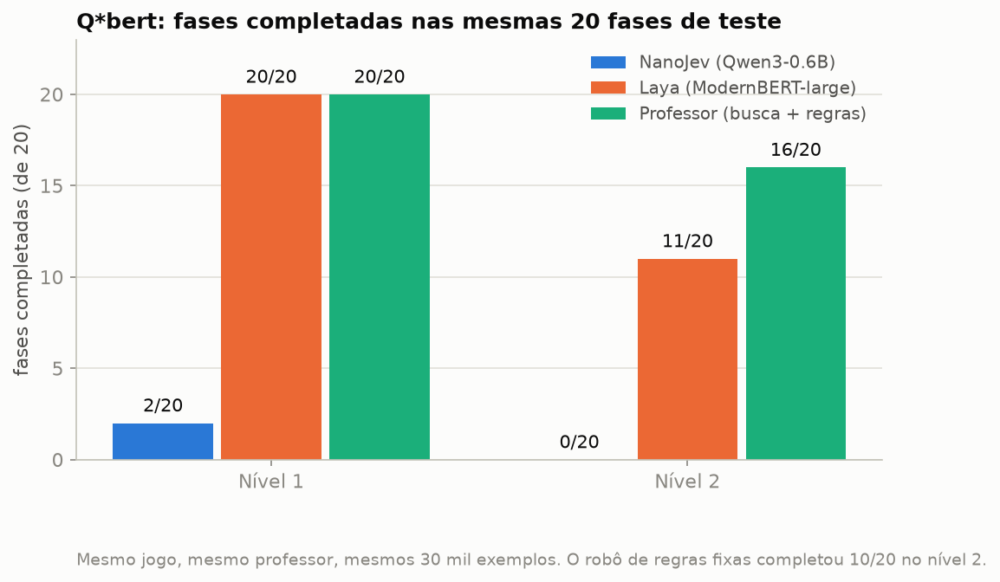

# NanoJev aprende Q\*bert: um professor em Python, 30 mil exemplos e uma placa de vídeo doméstica

Experiência de **ensinar um modelo de decisão (NanoJev, Qwen3-0.6B) a jogar Q\*bert** — um jogo que ele nunca viu —
imitando as notas de um **professor escrito em Python**. Tudo roda numa RTX 3060 de 12 GB.
O jogo foi recriado do zero, por turnos, com as regras e o visual da versão **Philips Odyssey** (manual brasileiro).



---

## A ideia em uma frase

O modelo aprende **imitando as notas de um professor**: em milhares de situações, o professor diz
"esta jogada vale 80%, aquela 15%, aquela 5%", e o modelo é ajustado aos pouquinhos até dar notas parecidas.

```
  O JOGO (Python) ──situação em texto──▶ PROFESSOR ──notas das 5 jogadas──▶ EXEMPLO de treino
                                                                                │ 30 mil
                                                                                ▼
                     TREINO: o NanoJev dá as notas dele; mede-se a diferença para as do professor;
                     os números internos do modelo são corrigidos um pouquinho para diminuí-la.
```

## O professor (`qbert/professor.py`)

```
nota(jogada) = nota do robô de regras  −  80 × chance de morrer nos próximos 3 passos (12 simulações)
```

- **Vontade de pintar cubos** vem do robô de regras; **enxergar o perigo** vem de simulações curtas.
- As notas viram porcentagens com uma *softmax* (temperatura 8; 4 no segundo treino, mais "decidida").
- Horizonte curto foi a chave: com 8 passos, os erros do próprio robô dentro da simulação contavam como risco.

| Nível (40 etapas, 3 vidas) | Robô de regras | Professor |
|---|---|---|
| 1 | 40/40 | 40/40 (com mais vidas sobrando) |
| 2 | 25/40 | **29/40** |

## Os dados (`qbert/dados/`)

- 320 partidas do professor (160 no nível 1, 160 no nível 2), gravando **cada decisão** no formato do NanoJev
  (`state`, as 5 opções, as notas do professor). Em 10% das decisões ele joga uma opção sorteada, para o modelo ver
  situações "fora do caminho ideal".
- **30.336 decisões**: treino 24.079 · validação 3.243 · teste 3.014 (divididas por partida — o modelo nunca é
  avaliado numa partida que viu).
- Arquivos compactados (`*.jsonl.gz`); para usar: `gunzip qbert/dados/*.gz` (ou `python -c "import gzip,shutil;…"`).
- Cada situação vira ~**4.300 tokens** (≈ 860 por opção × 5) — é o que mais pesa no tempo de treino.

## O treino (`qbert/treinar_qbert.py`)

Reaproveita as peças do autor (o mesmo `DecisionModel`, o mesmo formato de texto e a mesma conta de erro), partindo
do modelo que já joga Snake/Labirinto. Cada passo usa **12 situações de Q\*bert + 4 dos jogos originais**, para não
esquecer o que já sabia.

| Truque para caber em 12 GB | Efeito |
|---|---|
| contas em bf16 | ~metade da memória das contas |
| *gradient checkpointing* | vários GB a menos, ~30% mais lento |
| vocabulário congelado (~155 M números) | ~2 GB a menos |
| lotes de até 8.192 tokens | pico de memória baixo (9,4 GB) |

Proteções: pausas automáticas quando a placa esquenta, ponto de retomada, vigia (`vigiar_treino.ps1`).
Dois treinos (v1 e v2), cerca de **15 horas** de placa de vídeo no total.



## Resultado jogando de verdade (20 fases de teste por nível)

| Nível | Quem joga | Fases completas | Cubos faltando (média) |
|---|---|---|---|
| 1 | NanoJev original | 0/20 | 24,7 |
| 1 | **NanoJev treinado (v2)** | **2/20** | **3,8** |
| 1 | professor | 20/20 | 0 |
| 2 | NanoJev original | 0/20 | 27,6 |
| 2 | **NanoJev treinado (v2)** | 0/20 | **12,2** |
| 2 | professor | 16/20 | 1,0 |

As **primeiras fases completas** pelo NanoJev vieram no v2. A principal causa de morte é a **Serpente** (69% das vidas
perdidas). Snake e Labirinto continuaram funcionando depois do treino (3/3 e 4/5).



A comparação com outra IA (Laya), treinada com **os mesmos 30 mil exemplos**, está no repositório **laya-qbert**:
com um texto de situação enxuto (~190 tokens em vez de ~4.300), ela chegou a 20/20 no nível 1.

## O que tem aqui

```
nanojev-qbert/
├── qbert/
│   ├── qbert_env.py          # o jogo (por turnos; regras Odyssey ou arcade; inimigos, discos, níveis)
│   ├── professor.py          # o professor (robô de regras + risco de morte em 3 passos)
│   ├── gerar_dados.py        # gera as 30 mil decisões (14 processos em paralelo)
│   ├── treinar_qbert.py      # o treino do NanoJev (12 GB, bf16, checkpointing, retomada)
│   ├── avaliar_jogando.py    # avaliação jogando as 20 fases de teste
│   ├── causas_morte.py       # o que matou cada vida
│   ├── servidor_qbert.py     # servidor da página (porta 8767)
│   ├── index.html            # a página: jogo, notas de cada jogada, texto enviado ao modelo, gravação em vídeo
│   ├── testar_qbert.py, extrair_quadros.py, zoom_video.py, converter_video.py, vigiar_treino.ps1
│   ├── resultados_jogando.json
│   ├── dados/                # train/dev/test .jsonl.gz
│   └── videos/               # uma partida gravada (MP4)
├── resultados/               # registro do treino v2 (log.json, progresso)
├── docs/
│   ├── TREINAMENTO_QBERT.md  # o treino explicado por dentro, com o diário e os resultados
│   ├── REGISTRO.md           # diário de todo o trabalho
│   └── ARTIGO_LINKEDIN.md    # o artigo publicado (e as ferramentas de negrito Unicode)
└── imagens/
```

## Como rodar

1. Instale o NanoJev original (<https://github.com/TianyuCodings/NanoJev>) e copie a pasta `qbert/` para dentro dele.
2. Jogar e assistir: `qbert\iniciar_qbert.bat` → <http://127.0.0.1:8767> (robô, professor, modelo ou você no teclado).
3. Treinar: descompacte os dados e rode `python qbert/treinar_qbert.py` (os caminhos do ambiente original estão no
   começo do arquivo). Os modelos treinados não estão no repositório (tamanho); o registro do treino está em `resultados/`.

## Sobre o jogo original

Q\*bert é marca da Gottlieb/Sony; a versão de referência é a do **Philips Odyssey²** (Parker Brothers).
Este repositório traz **uma recriação própria** para pesquisa, feita a partir do manual brasileiro e da observação
de partidas gravadas; **não contém** a ROM, imagens ou código do jogo original (as capturas de referência usadas
durante o desenvolvimento ficaram de fora).

## Créditos e licença

- **NanoJev / OpenJev**: <https://github.com/TianyuCodings/NanoJev> (MIT, © OpenJev contributors);
  modelo base **Qwen3-0.6B** (Alibaba, Apache-2.0).
- Jogo, professor, dados, treino, página e documentação deste repositório: Mateus Silva.

Licença: **MIT**, herdada do NanoJev — veja [`LICENSE`](LICENSE).
